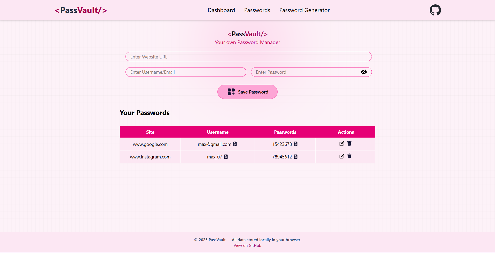

# <PassVault />

> **Your own Password Manager.**
> A secure, responsive, and local-storage based password manager built with React and Tailwind CSS.



## 📋 Table of Contents
- [About](#about)
- [Features](#features)
- [Tech Stack](#tech-stack)
- [Getting Started](#getting-started)
- [Usage](#usage)
- [Disclaimer](#disclaimer)

## 🌸 About
**PassVault** is a modern web application designed to help users store and manage their passwords locally in their browser. Built with a "Mobile-First" approach, it features a sleek pink-themed UI, responsive design, and intuitive user experience. It utilizes the browser's `localStorage` to persist data, ensuring your passwords remain saved even after refreshing the page.

## ✨ Features

* **Responsive Design:** Fully optimized for Desktop, Tablet, and Mobile devices.
    * *Mobile:* Hamburger menu navigation and horizontally scrollable data tables.
    * *Desktop:* Full dashboard view with side-by-side inputs.
* **CRUD Operations:** Create, Read, Update, and Delete password entries easily.
* **Visual Privacy:** Toggle password visibility (Mask/Unmask) using the eye icon.
* **One-Click Copy:** Copy usernames or passwords to the clipboard instantly with a toast notification confirmation.
* **Local Storage:** Data is persisted in the browser's Local Storage, meaning no backend server is required.
* **Interactive UI:** Animated icons using Lordicon and smooth hover effects.
* **Smart Validation:** Prevents saving empty fields or duplicate entries.

## 🛠 Tech Stack

* **Frontend Library:** [React.js](https://react.dev/)
* **Styling:** [Tailwind CSS](https://tailwindcss.com/)
* **Icons:** [Lordicon](https://lordicon.com/) (Animated) & Local SVGs
* **Notifications:** [React-Toastify](https://fkhadra.github.io/react-toastify/)
* **ID Generation:** [UUID](https://www.npmjs.com/package/uuid)

## 🚀 Getting Started

Follow these steps to set up the project locally on your machine.

### Prerequisites
Make sure you have [Node.js](https://nodejs.org/) installed.

### Installation

1.  **Clone the repository**
    ```bash
    git clone [https://github.com/username/password-manager.git](https://github.com/maruthu04/password-manager.git)
    cd passvault
    ```

2.  **Install dependencies**
    ```bash
    npm install
    ```

3.  **Run the development server**
    ```bash
    npm run dev
    # or if using Create React App:
    # npm start
    ```

4.  Open your browser and navigate to `http://localhost:5173` (or the port shown in your terminal).

## 📖 Usage

1.  **Add a Password:**
    * Enter the Website URL (e.g., `google.com`).
    * Enter your Username/Email.
    * Enter your Password.
    * Click **Save Password** (or **Save** on mobile).
2.  **View Passwords:** Scroll down to the "Your Passwords" section. On mobile, you can swipe the table left/right to see all details.
3.  **Copy Data:** Hover over the copy icon next to the username or password and click to copy it to your clipboard.
4.  **Edit/Delete:** Use the pencil icon to edit an entry or the trash bin icon to delete it.

## ⚠️ Disclaimer
This project uses **LocalStorage** to store passwords. LocalStorage is not encrypted and can be accessed by anyone with physical access to your browser or via XSS attacks. **This project is intended for educational purposes and portfolio demonstration.** It is not recommended for storing highly sensitive real-world banking or critical passwords without further encryption layers.

## 📄 License
This project is open source and available under the [MIT License](LICENSE).

---
*Made with ❤️ by Maruthu
